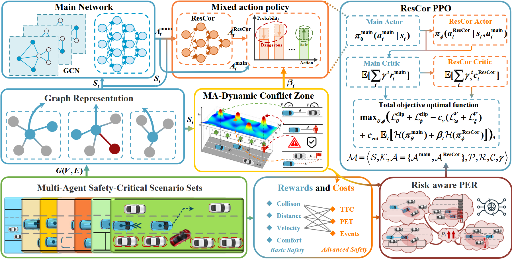

<div align="center">   
  
# ResCor: Residual Correct Reinforcement Learning for Multi-vehicle Safety-critical Scenarios
</div>


# Abstract
Autonomous vehicles (AVs) must achieve safety reliability 10<sup>2</sup> to 10<sup>9</sup> times higher than human drivers for societal acceptance. Existing research has made remarkable strides in single-vehicle crash avoidance through advanced decision-making systems. However, the safety challenges posed by multi-vehicle safety-critical scenarios (MVSCS) exceed the capabilities of individual vehicles, particularly under collision risks, where the safety responses of single AVs can paradoxically lead to collective safety failures. Here we propose **ResCor**, a **res**idual **cor**rection framework leveraging weak-to-strong generalization principles. Specifically, by using a lightweight ResCor model to correct unsafe collective behaviors, it guides the dynamic and stable expansion of the hybrid policy space, thereby addressing mutual deadlocks and cascading failures in MVSCS. Our framework features a ResCor Markov Decision Process integrated with multi-agent dynamic conflict zones for risk quantification and risk-aware prioritized experience replay mechanisms. Experiments across seven MVSCS demonstrate that ResCor achieves 90.6% collision reduction and 51.6% reward improvement compared to strong baselines, using only 10% of the main model's parameters. The framework exhibits stable transferability to unseen complex scenarios, validating its potential as a lightweight pre-trained safety module for real-world deployment.


# Methods



# Demonstration Video
## Hardware-in-the-loop Experiments
### 1. HardBrake (3AVs)
https://github.com/user-attachments/assets/1dfaa2e4-8dd4-4e08-b92c-699eabd69a9c

### 2. ParkingCrossingPed (3AVs)
https://github.com/user-attachments/assets/fddf31f0-bfc5-4790-bba9-4bc88898c6fd

### 3. ParkingCutIn
https://github.com/user-attachments/assets/59c0fd99-6c17-4da7-925f-2d2bd617b604

## Simulation Experiments
### 1. HardBrake (2AVs)
https://github.com/user-attachments/assets/ac8e81d7-cf39-4a5c-bac0-27793a0c4f24

### 2. ParkingCrossingPed (2AVs)
https://github.com/user-attachments/assets/5659d0e5-7e48-4d6f-929a-80b206f37ca0

### 3. ParkingCutIn
https://github.com/user-attachments/assets/ad107dbe-013d-4183-a8f2-6b7c0158b1ca

### 4. DynamicCutIn
https://github.com/user-attachments/assets/dbd3a38f-2784-47c0-b262-e71fa555d7b0

### 5. IntersectionViolationPeds
https://github.com/user-attachments/assets/cf657518-d6f9-49ce-ae02-94995181d90f

### 6. HardBrake (3AVs)
https://github.com/user-attachments/assets/37929d86-a99d-4890-9fdd-cb41a4ab0b9f

### 7. ParkingCrossingPed (3AVs)
https://github.com/user-attachments/assets/636fd581-a585-4c76-baa9-9c33de8ec5f9


# Installation
```shell
# Clone the code to local
git clone https://github.com/fightmore2019/ResCor-anonymization.git
cd ResCor-anonymization

# Create virtual environment
conda create -n ResCor python=3.7
conda activate ResCor

# Install basic dependency
pip install -r requirements.txt
```
